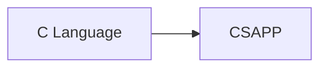

# learn-cs
这个repo的最终目标是总结一套在国内对计算机科学的自学之路, 在国内计算机教育普遍存在缺陷的状况下, 我希望能找到一条学习所有必需课程的路线, 少一些人走我走过的弯路. 这个repo会记录我自己的学习路线和笔记, 在提供学习路线的同时提供思路和我的一些感受, 辅助理解.

## 学习路线

```mermaid
graph LR;
    C[C Language]-->CSAPP[CSAPP];

click C "https://wangdoc.com/clang/" "C语言教程"
click CSAPP "./courses/csapp" "15-213"
```